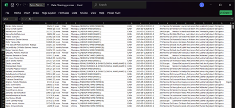
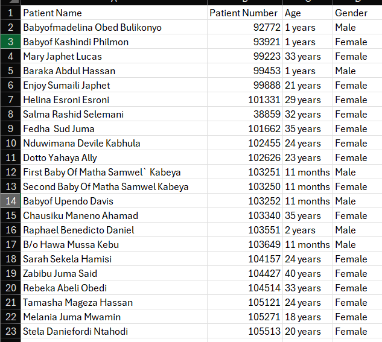
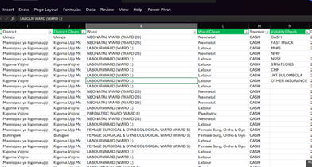
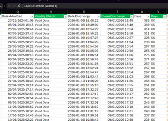
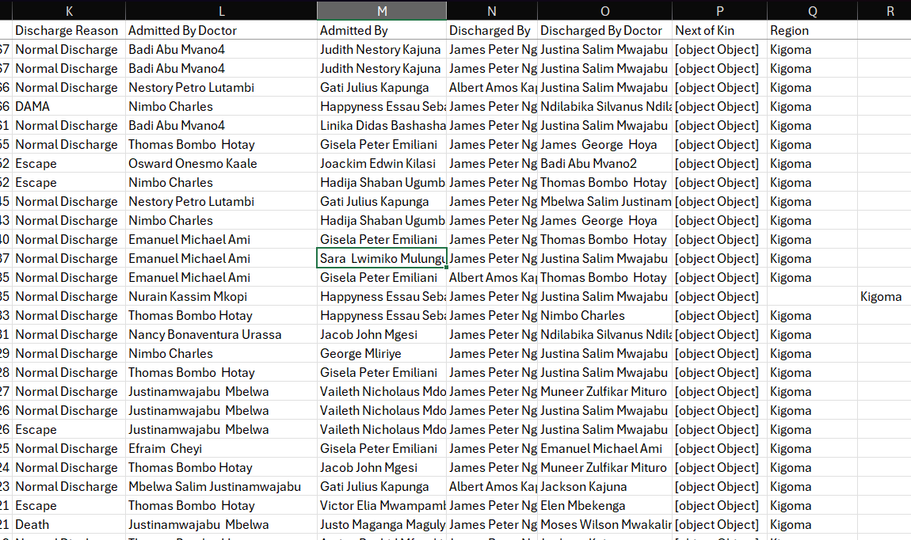
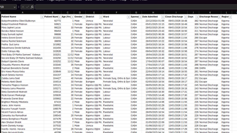

# Data Cleaning Process: Hospital Admission & Discharge Records

This documents the data-quality issues found in the raw patient admission/discharge dataset and the cleaning steps applied to resolve them, as recorded in the workbook's **Raw Dataset**, **Cleaning Process**, and **Clean Dataset** sheets.

| Metric | Value |
|---|---|
| Raw records | 907 rows × 18 columns |
| Records carried through cleaning workflow | 906 rows analyzed |
| Final clean records | 905 rows × 12 columns |
| Sheets in workbook | Raw Dataset · Cleaning Process · Clean Dataset |

---

## 1. Raw Dataset

A representative excerpt of the untouched source data:



---

## 2. Data Quality Issues Identified

The Cleaning Process sheet runs each raw field through validation and standardization formulas, flagging problems column by column.

| Field | Issue Found | Detail |
|---|---|---|
| Patient Number | Duplicate IDs | 44 of 906 rows share a Patient Number with another row (flagged "Duplicate"); 862 are unique |
| Age | Mixed units in one field | Stored as free text such as "1 years", "11 months", not usable for numeric analysis |
| Gender | Inconsistent labels | Checked for values outside "Male"/"Female"; all 906 rows passed as Valid |
| District | Spelling/naming variants | 11 raw spellings collapsed to 10 standardized names (e.g. "Manisipaa ya kigoma ujiji" → "Kigoma Ujiji Mc"; "Buhingwe" → "Buhigwe") |
| Ward | Free-text ward/room labels | Long raw labels (e.g. "FEMALE SURGICAL & GYNECOLOGICAL WARD (WARD 5)") mapped to 11 standardized ward categories |
| Sponsor | Unstandardized categories | `UNIQUE()` inventory surfaced 9 distinct payer categories (CASH, NHIF, NSSF, MHIS, FAST TRACK, CHF, OTHER INSURANCE, STRATEGIES, and one facility code) |
| Date Admitted | Text, not real dates | 904 of 906 rows stored the timestamp as text ("Text Error"), blocking date math and sorting |
| Date Discharge | Mostly valid | Already numeric/date in nearly all rows; a standardized "Clean Discharge" column was produced |
| Days (length of stay) | Checked for errors | Row-by-row check: validated as numeric and non-negative, all 906 rows OK |
| Discharge Reason | Category inventory | `UNIQUE()` inventory surfaced 5 categories in use: Normal Discharge, Escape, DAMA, Death, Referred |
| Region | Outlier values | `UNIQUE()` inventory surfaced 3 distinct regions: Kigoma (904 rows), Katavi (1), Tabora (1). The 2 non-Kigoma rows were flagged for review |

---

## 3. Cleaning Methodology

Each field was cleaned with a dedicated formula placed in an adjacent helper column (headers highlighted in green), so the original raw values are preserved side-by-side with the corrected values.

Two different validation techniques appear in the workbook:
- **Row-by-row checks** (Patient Name, Patient Number, Age, Gender, Days) evaluate every single row and return a per-row verdict, e.g. "OK" / "Text Error" / "Negative".
- **Category-inventory checks** (Sponsor, Discharge Reason, Region) use a single `UNIQUE()` array formula placed once in row 2 that spills down and lists every distinct value found anywhere in that column, rather than flagging individual rows.

### Name, ID, age, and gender checks

**Patient Name, name-completeness check**
```excel
=IF(LEN(TRIM(A2))-LEN(SUBSTITUTE(TRIM(A2)," ",""))>=1,TRIM(A2),"⚠ Only 1 name: "&TRIM(A2))
```
Trims extra spaces and checks the name contains at least one space (i.e. two or more name parts). If not, it prepends a warning flag rather than silently passing a single-word name through.

**Patient Number, duplicate check**
```excel
=IF(COUNTIF($C$2:$C$905,C2)>1,"Duplicate","Unique")
```
Counts how many times this Patient Number appears in the whole column. 44 of 906 rows came back Duplicate.

**Age, text-to-number conversion**
```excel
=IF(ISNUMBER(SEARCH("month",E2)), LEFT(E2,FIND(" ",E2)-1)&"/12", VALUE(LEFT(E2,FIND(" ",E2)-1)))
```
Pulls the leading number out of free text like "1 years" or "11 months". If the text says "month", it's expressed as a fraction of a year (e.g. "11 months" → 11/12); otherwise the number is taken as whole years.

**Gender, validity check**
```excel
=IF(OR(TRIM(G2)="Male", TRIM(G2)="Female"), "Valid", "Inconsistent")
```
Flags anything other than exactly "Male" or "Female" as "Inconsistent". All 906 rows passed as Valid.



### District, ward, and sponsor standardization

**District, spelling standardization**
```excel
=SUBSTITUTE(SUBSTITUTE(TRIM(CLEAN(I2)),"Manisipaa ya kigoma ujiji","Kigoma Ujiji Mc"),"Buhingwe","Buhigwe")
```
`CLEAN()` strips non-printable characters, `TRIM()` removes extra spaces, then two nested `SUBSTITUTE()` calls rewrite the two known misspellings to one standard name each.

**Ward, keyword mapping**
```excel
=IFS(
ISNUMBER(SEARCH("ICU",K2)), "ICU",
ISNUMBER(SEARCH("NEONATAL",K2)), PROPER("NEONATAL"),
ISNUMBER(SEARCH("LABOUR",K2)), PROPER("LABOUR"),
ISNUMBER(SEARCH("PAEDIATRIC",K2)), PROPER("PAEDIATRIC"),
... (11 conditions total),
TRUE, "Unmapped: " & K2)
```
Searches the raw ward/room text for a keyword and returns a short, standardized ward category for the first keyword it matches. A final `TRUE` branch would label anything unrecognized as "Unmapped", none occurred, so all 906 rows matched one of 11 categories.

**Sponsor, category inventory**
```excel
=UNIQUE(M2:M907)
```
Lists every distinct payer/sponsor value found anywhere in the raw Sponsor column, spilling down from this one cell. Surfaced 9 categories, letting a reviewer eyeball the list for stray or misspelled entries.



### Date and length-of-stay checks

**Date Admitted, text-vs-date check**
```excel
=IF(ISNUMBER(O2), "Valid Date", "Text Error")
```
A true Excel date is stored internally as a number; text that only looks like a date is not. This returns "Text Error" whenever the raw cell isn't a real number, true for 904 of 906 rows.

**Date Admitted (parsed), re-check**
```excel
=IF(ISNUMBER(Q2), "Valid Date", "Text Error")
```
The same check applied to a parsed working copy of the date, to confirm the conversion actually produced a real date value.

**Days, non-numeric / negative check**
```excel
=IF(NOT(ISNUMBER(U2)), "Text Error", IF(U2<0, "Negative", "OK"))
```
Checks every row individually: "Text Error" if length of stay isn't a number, "Negative" if it's below zero, otherwise "OK". All 906 rows returned OK.



### Discharge Reason and Region checks

**Discharge Reason, category inventory**
```excel
=UNIQUE(W2:W907)
```
Spills the 5 distinct discharge reasons found in the raw data (Normal Discharge, Escape, DAMA, Death, Referred) into a column for a quick visual scan. It does not flag individual rows.

**Region, category inventory**
```excel
=UNIQUE(Y2:Y907)
```
Spills the 3 distinct region values found in the raw data (Kigoma, Katavi, Tabora). This is how the 2 non-Kigoma rows were spotted. Anything other than "Kigoma" stands out immediately in the short spilled list.



### Date column fix: Text to Columns

The broken Date Admitted column (text instead of real dates) was standardized using Excel's Text to Columns feature:

1. Select the entire Date column
2. Data tab → Text to Columns
3. Choose Delimited → Next
4. Uncheck all delimiter boxes → Next
5. Under Column data format, choose Date and select YMD
6. Click Finish
7. Format the column as Short Date or a custom `YYYY-MM-DD HH:MM:SS` format (Ctrl+1)

---

## 4. Final Clean Dataset

The Clean Dataset sheet keeps only the corrected values, condensed to 12 columns: Patient Name, Patient Number, Age (Yrs), Gender, District, Ward, Sponsor, Date Admitted, Clean Discharge, Days, Discharge Reason, and Region.



---

## 5. Validation Summary

| Field | Validation Outcome |
|---|---|
| Date Admitted | Confirmed broken: 904 of 906 rows were stored as text instead of real dates. Standardized using Excel's Text to Columns feature (Delimited → Date → YMD), converting the column to true date/time values. |
| Days (length of stay) | Confirmed valid: all 906 rows are numeric and non-negative. No correction needed. |
| Discharge Reason | Confirmed valid: all 5 categories found are legitimate, expected values. No correction needed. |
| Region | Confirmed valid: all 3 values found are legitimate entries, not typos. No correction needed. |
| Patient Number | 44 duplicate Patient Numbers confirmed as readmitted patients, the same patient returning for a separate admission episode, not data-entry duplicates. Retained in the dataset as distinct admission records. |

---

## 6. Summary & Recommendations

- The 44 duplicate Patient Numbers are confirmed readmissions, not errors, keep them as separate admission records, but be aware when counting "patients" vs. "admissions" that these represent the same person more than once.
- Date Admitted has been standardized via Text to Columns; re-apply the same check to Date Discharge if it is ever re-entered as text.
- Days, Discharge Reason, and Region all passed validation as-is, no further correction needed for these fields.
- Retain the standardized District, Ward, and Discharge Reason categories for consistent reporting/analysis going forward.
- The Clean Dataset sheet is ready to be used as the analysis-ready source for downstream reporting.
- Some columns (Admitted By Doctor, Next of Kin, Discharged By Doctor, and Discharged By) were dropped due to their irrelevance in answering possible healthcare analytical questions.

## Privacy note

The raw export originally included real names in `Patient Name` and several staff-identifying columns (`Admitted By Doctor`, `Admitted By`, `Discharged By`, `Discharged By Doctor`), plus a broken `Next of Kin` field. These are not required for ward-, district-, or outcome-level analysis and should be excluded from any published version of the raw data.
